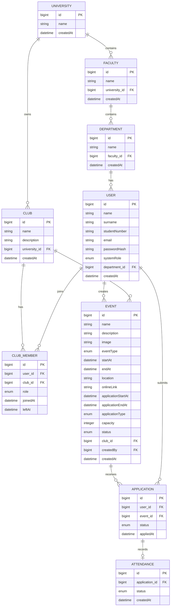

# Domain Model

> **Status:** Draft / Under Review
>
> This document defines the current domain model of the university clubs and events platform.
> The model may change during requirements analysis before implementation.
>
> Event and application business rules are documented separately in:
> `docs/business-rules/event-and-application-business-rules.md`

## 1. Entity Overview

The current domain model consists of the following entities:

* `User`
* `University`
* `Faculty`
* `Department`
* `Club`
* `ClubMember`
* `Event`
* `Application`
* `Attendance`

---

## Domain Diagram


## 2. Domain Relationships



---

## 3. Entities

### 3.1 User

Represents all users of the system, including system administrators.

```text
User
├── id
├── name
├── surname
├── studentNumber
├── email
├── passwordHash
├── systemRole
├── department
└── createdAt
```

`systemRole`:

* `USER`
* `ADMIN`

The user's university and faculty are derived through:

```text
User → Department → Faculty → University
```

`studentNumber` is expected to be unique within a university rather than globally.

Potential database constraint:

```text
UNIQUE (university_id, student_number)
```

The exact database implementation will be finalized during schema design.

---

### 3.2 University

Represents a university registered in the system.

```text
University
├── id
├── name
└── createdAt
```

Relationships:

```text
University 1 ─── N Faculty
University 1 ─── N Club
```

---

### 3.3 Faculty

Represents a faculty belonging to a university.

```text
Faculty
├── id
├── name
├── university
└── createdAt
```

Relationship:

```text
University 1 ─── N Faculty
```

---

### 3.4 Department

Represents a department belonging to a faculty.

```text
Department
├── id
├── name
├── faculty
└── createdAt
```

Relationship:

```text
Faculty 1 ─── N Department
```

---

### 3.5 Club

Represents a university club.

```text
Club
├── id
├── name
├── description
├── university
└── createdAt
```

A club belongs to a university.

Club creation is restricted to users with the `ADMIN` system role.

The creator of a club is not stored as a separate field.

Relationship:

```text
University 1 ─── N Club
```

---

### 3.6 ClubMember

Represents a user's membership and role within a club.

```text
ClubMember
├── id
├── user
├── club
├── role
├── joinedAt
└── leftAt
```

`role`:

* `PRESIDENT`
* `VICE_PRESIDENT`
* `MANAGER`

A user may belong to multiple clubs and may have different roles in different clubs.

`leftAt = NULL` means that the membership is currently active.

Historical memberships are preserved rather than deleted.

Business/database rule:

> A user cannot have more than one active membership record for the same club.

---

### 3.7 Event

Represents an event organized by a club.

```text
Event
├── id
├── name
├── description
├── image
├── eventType
├── startAt
├── endAt
├── location
├── onlineLink
├── applicationStartAt
├── applicationEndAt
├── applicationType
├── capacity
├── status
├── club
├── createdBy
└── createdAt
```

`eventType`:

* `PHYSICAL`
* `ONLINE`

`applicationType`:

* `PUBLIC`
* `APPROVAL_REQUIRED`

`status`:

* `PUBLISHED`
* `COMPLETED`
* `CANCELLED`

`capacity = NULL` means unlimited capacity.

`createdBy` stores the user who created the event for audit/history purposes.

An event belongs to a club.

Relationships:

```text
Club 1 ─── N Event
User 1 ─── N Event (createdBy)
```

Detailed event and application rules are defined in:

`docs/business-rules/event-and-application-business-rules.md`

---

### 3.8 Application

Represents a user's application to an event.

```text
Application
├── id
├── user
├── event
├── status
└── appliedAt
```

`status`:

* `PENDING`
* `ACCEPTED`
* `REJECTED`
* `WAITLISTED`
* `WITHDRAWN`

Relationships:

```text
User 1 ─── N Application
Event 1 ─── N Application
```

`appliedAt` is used for waitlist ordering.

`NOT_ATTENDED` is intentionally not an application status. Attendance is represented separately by `Attendance`.

A user may have only one active application for an event.

---

### 3.9 Attendance

Represents the participation result of an accepted application.

```text
Attendance
├── id
├── application
├── status
└── createdAt
```

Relationship:

```text
Application 1 ─── 0..1 Attendance
```

`status`:

* `NULL` — participation has not yet been determined
* `ATTENDED` — user attended
* `NOT_ATTENDED` — user did not attend

The expected participation flow is:

```text
Application.status = ACCEPTED
            │
            ▼
Event starts
            │
            ▼
Attendance created
status = NULL
            │
       ┌────┴────┐
       ▼         ▼
    QR scan    Time expires
       │         │
       ▼         ▼
   ATTENDED  NOT_ATTENDED
```

Attendance references `Application` rather than storing `user` and `event` separately.

Therefore:

```text
Attendance → Application → User
                         → Event
```

`application_id` should be unique so that each application can have at most one attendance record.

The exact duration after `endAt` during which attendance can still be recorded will be defined later.

---

## 4. Important Domain Decisions

### User and university identity

Student numbers are expected to be unique within a university.

```text
University + studentNumber → UNIQUE
```

### Club membership history

Memberships are not deleted when a user leaves a club.

```text
leftAt = NULL  → active
leftAt != NULL → historical
```

### Event creator

`Event.createdBy` is kept for audit/history purposes.

### Application and attendance

Application status and attendance status represent different concepts.

```text
Application.status
→ application process

Attendance.status
→ actual participation
```

Therefore `NOT_ATTENDED` is not an `Application.status`.

### Attendance and event relationship

`Attendance` does not directly reference `Event`.

```text
Attendance → Application → Event
```

A direct `eventId` may be considered in the future if reporting/query performance or a separate reporting model makes it necessary.

### Notifications

Notifications are outside the MVP and are planned for a later version.

---

## 5. Related Documentation

* Business rules:
  `docs/business-rules/event-and-application-business-rules.md`
* Use cases:
  `docs/use-cases/`
* Domain model:
  `docs/domain-model.md`

This document should be updated whenever a domain-level decision changes.
